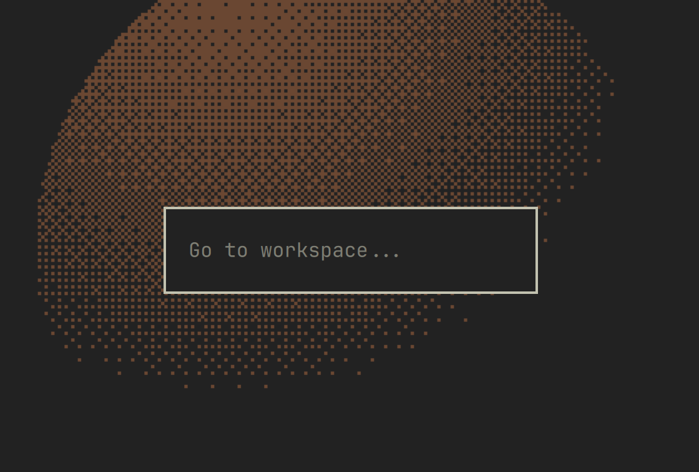

# Any Workspace

A visual workspace switcher overlay for the [Omarchy](https://omarchy.org)
Quattro shell. Summon it, type a workspace number, and it jumps there — or moves
the focused window to that workspace. It keeps `keepLoaded` as a lightweight
overlay (same pattern as `omarchy.reminders`) and dispatches straight to
Hyprland through Omarchy's `hl.dsp.*` Dynamic State Protocol, so it works for
any workspace number, including beyond 10.

This replaces the old "[workspaces beyond 10](https://github.com/pmpinto/hyprland-workspaces-above-10)" flow, which made you type a number
blindly into a Hyprland submap banner. Here you see exactly what you're typing
in a styled card, and the number is validated before dispatch.

## Preview



## Usage

The overlay is bound to two keys:

| Keys | Action | Prompt |
|---|---|---|
| `SUPER + ALT + =` | Go to workspace | "Go to workspace" |
| `SUPER + ALT + SHIFT + =` | Move focused window to workspace | "Move window to workspace" |

Type the workspace number and press **Enter** to confirm, or **Esc** to cancel
(first Esc clears the field, second Esc closes). Clicking outside the card also
cancels.

The number is used **literally** — `0` goes to workspace 0, `10` goes to
workspace 10. Non-numeric input is ignored and the overlay simply closes.

## How it works

- A keybinding summons the overlay through the bundled `bin/any-workspace` wrapper:
  ```sh
  ~/.config/omarchy/plugins/any-workspace/bin/any-workspace go-to
  ~/.config/omarchy/plugins/any-workspace/bin/any-workspace move-to
  ```
  (each of which calls `omarchy-shell shell summon any-workspace '{"mode":"..."}'`).
- The overlay keeps the digits you type in memory and, on submit, dispatches:
  ```sh
  hyprctl dispatch "hl.dsp.focus({workspace='10'})"
  hyprctl dispatch "hl.dsp.window.move({workspace='10'})"
  ```
- The prompt never writes state to disk; it is a pure input → dispatch flow.

## Install

Install from the plugin repository:

```sh
omarchy plugin add git@github.com:pmpinto/omarchy-any-workspace.git --enable
```

This clones the plugin into `~/.config/omarchy/plugins/any-workspace/`, validates
it, and enables it. It must remain listed in the `plugins[]` array of
`~/.config/omarchy/shell.json` so the non-first-party overlay is enabled:

```json
"plugins": [
  { "id": "any-workspace" }
]
```

Update later with:

```sh
omarchy plugin update any-workspace
```

## Keybindings

Overlays have no keybinding mechanism, so the Hyprland bind is per-user. Add two
bindings to `~/.config/hypr/bindings.lua` (free the keys first if your defaults
already use them):

```lua
hl.unbind("SUPER + ALT + code:20")
hl.unbind("SUPER + ALT + code:21")
hl.unbind("SUPER + SHIFT + ALT + code:20")
hl.unbind("SUPER + SHIFT + ALT + code:21")

o.bind("SUPER + ALT + code:21", "Go to workspace",
  "~/.config/omarchy/plugins/any-workspace/bin/any-workspace go-to")
o.bind("SUPER + ALT + SHIFT + code:21", "Move window to workspace",
  "~/.config/omarchy/plugins/any-workspace/bin/any-workspace move-to")
```

Pick whatever keys suit you — only the `o.bind` command needs to match.
(The `hl.unbind` lines disable Omarchy's default `SUPER+ALT+=`/`+=` window-resize
variants; adjust them to your setup.)

## Removal

```sh
omarchy plugin remove any-workspace
```

## Requirements

- An Omarchy Hyprland session (the dispatch relies on `hl.dsp.*`, Omarchy's
  Dynamic State Protocol dispatchers).
- No extra packages. Dispatch goes through the existing `hyprctl`.

## Plugin architecture

```
manifest.json                 declares one keep-loaded overlay entry point
WorkspacePrompt.qml           fullscreen scrim + centered card prompt; captures
                              the number and dispatches hyprctl on submit
WorkspacePromptModel.js       pure numeric validation (literal; 0 stays 0, 10
                              stays 10); unit-tested standalone
bin/any-workspace             tiny shell wrapper so keybindings don't spell out
                              the omarchy-shell summon JSON
tests/model.test.js           node:test coverage for the validation rules
```

`WorkspacePrompt.qml` is an overlay `kind` with `keepLoaded: true`, so the
layer-shell window survives between summons within a shell session, exactly like
`omarchy.reminders`. Dismissal goes through the shell host
(`shell.hide("any-workspace")`) so it composes with other overlays.

## Validating changes

```sh
omarchy plugin validate .
node tests/model.test.js
```

## License

MIT, see [LICENSE](LICENSE).
